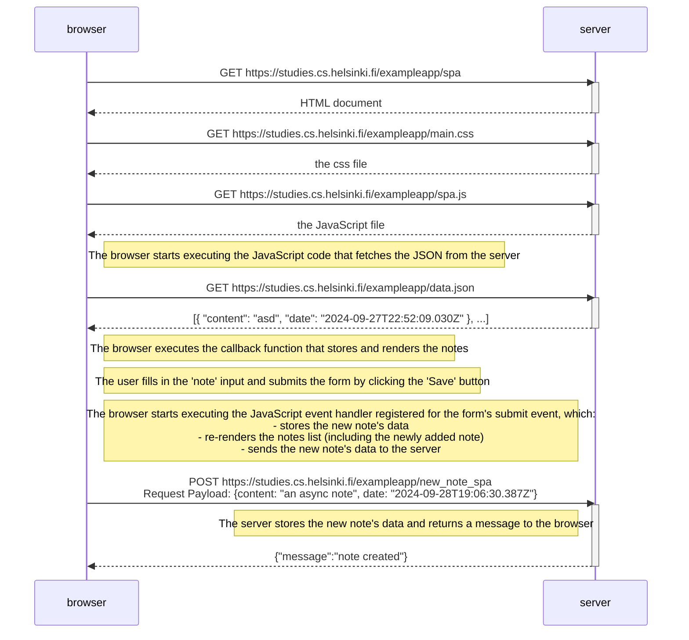

```mermaid
sequenceDiagram
participant browser
participant server

    browser->>server: GET https://studies.cs.helsinki.fi/exampleapp/spa
    activate server
    server-->>browser: HTML document
    deactivate server

    browser->>server: GET https://studies.cs.helsinki.fi/exampleapp/main.css
    activate server
    server-->>browser: the css file
    deactivate server

    browser->>server: GET https://studies.cs.helsinki.fi/exampleapp/spa.js
    activate server
    server-->>browser: the JavaScript file
    deactivate server

    Note right of browser: The browser starts executing the JavaScript code that fetches the JSON from the server

    browser->>server: GET https://studies.cs.helsinki.fi/exampleapp/data.json
    activate server
    server-->>browser: [{ "content": "asd", "date": "2024-09-27T22:52:09.030Z" }, ...]
    deactivate server

    Note right of browser: The browser executes the callback function that stores and renders the notes

    Note right of browser: The user fills in the 'note' input and submits the form by clicking the 'Save' button
    Note right of browser: The browser starts executing the JavaScript event handler registered for the form's submit event, which:<br>- stores the new note's data<br>- re-renders the notes list (including the newly added note)<br>- sends the new note's data to the server

    browser->>server: POST https://studies.cs.helsinki.fi/exampleapp/new_note_spa<br>Request Payload: {content: "an async note", date: "2024-09-28T19:06:30.387Z"}
    activate server
    Note left of server: The server stores the new note's data and returns a message to the browser
    server-->>browser: {"message":"note created"}
    deactivate server
```