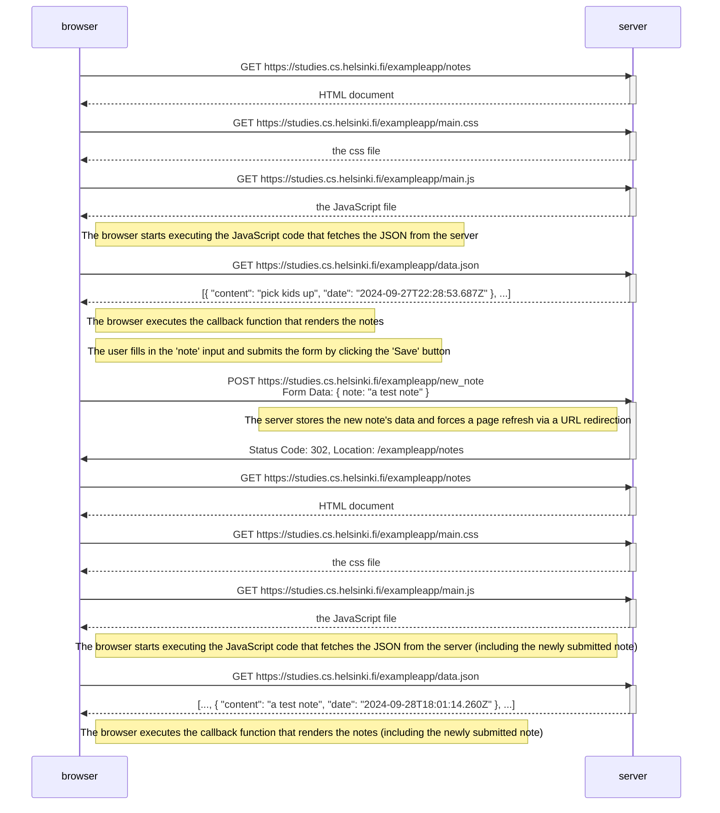

```mermaid
sequenceDiagram
participant browser
participant server

    browser->>server: GET https://studies.cs.helsinki.fi/exampleapp/notes
    activate server
    server-->>browser: HTML document
    deactivate server

    browser->>server: GET https://studies.cs.helsinki.fi/exampleapp/main.css
    activate server
    server-->>browser: the css file
    deactivate server

    browser->>server: GET https://studies.cs.helsinki.fi/exampleapp/main.js
    activate server
    server-->>browser: the JavaScript file
    deactivate server

    Note right of browser: The browser starts executing the JavaScript code that fetches the JSON from the server

    browser->>server: GET https://studies.cs.helsinki.fi/exampleapp/data.json
    activate server
    server-->>browser: [{ "content": "pick kids up", "date": "2024-09-27T22:28:53.687Z" }, ...]
    deactivate server

    Note right of browser: The browser executes the callback function that renders the notes
    
    Note right of browser: The user fills in the 'note' input and submits the form by clicking the 'Save' button
   
    browser->>server: POST https://studies.cs.helsinki.fi/exampleapp/new_note<br>Form Data: { note: "a test note" }
    activate server
    Note left of server: The server stores the new note's data and forces a page refresh via a URL redirection
    server->>browser: Status Code: 302, Location: /exampleapp/notes
    deactivate server

    browser->>server: GET https://studies.cs.helsinki.fi/exampleapp/notes
    activate server
    server-->>browser: HTML document
    deactivate server

    browser->>server: GET https://studies.cs.helsinki.fi/exampleapp/main.css
    activate server
    server-->>browser: the css file
    deactivate server

    browser->>server: GET https://studies.cs.helsinki.fi/exampleapp/main.js
    activate server
    server-->>browser: the JavaScript file
    deactivate server

    Note right of browser: The browser starts executing the JavaScript code that fetches the JSON from the server (including the newly submitted note)

    browser->>server: GET https://studies.cs.helsinki.fi/exampleapp/data.json
    activate server
    server-->>browser: [..., { "content": "a test note", "date": "2024-09-28T18:01:14.260Z" }, ...]
    deactivate server

    Note right of browser: The browser executes the callback function that renders the notes (including the newly submitted note)
```